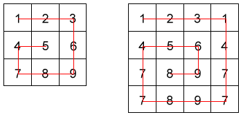

# Refactoring Challenge

This is a refactoring challenge created for the 12 November 2019 COP meetup "Refactoring Techniques".

The project contains code written in 5 languages (C, C++, C#, Javascript, Python) that in desperate need of some refactoring! The code solves the [Snail Sort problem](#snail-sort-problem) from [codewars](https://www.codewars.com/kata/snail/train/). Your challenge is to refactor the solution in your chosen language. GOOD LUCK! 

It's up to YOU how much time you spend on the problem, spend as little as 5 minutes (ie rename a couple of variables) or as long as an hour or two doing a full-refactor (ie rewrite the solution or train on the actual [codewars snail sort problem](https://www.codewars.com/kata/snail/train/)).

NOTE - you don't _have_ to sign-up for codewars to participate, just clone the repo or copy the code into IDE of your choice and go from there.

Capture your solutions on Gitlab / Github / Bitbucket and bring it along to the COP meetup (12th November).

## Snail Sort problem

Given an n x n array, return the array elements arranged from outermost elements to the middle element, travelling clockwise.

```c
array = [[1,2,3],
         [4,5,6],
         [7,8,9]]
snail(array) #=> [1,2,3,6,9,8,7,4,5]
```

For better understanding, please follow the numbers of the next array consecutively:

```c
array = [[1,2,3],
         [8,9,4],
         [7,6,5]]
snail(array) #=> [1,2,3,4,5,6,7,8,9]
```

This image will illustrate things more clearly:




NOTE: The idea is not sort the elements from the lowest value to the highest; the idea is to traverse the 2-d array in a clockwise snailshell pattern.

NOTE 2: The 0x0 (empty matrix) is represented as en empty array inside an array [[]].